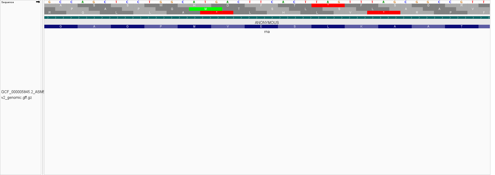

# Week_02: Visualize Genomic Data

## Genome Selected

For this assignment, I selected *Escherichia coli* K-12 MG1655 bacteria genome.

- **RefSeq Assembly Accession:** `GCF_000005845.2`
- **Assembly Name:** `ASM584v2`
- **Reference Chromosome:** `NC_000913.3`
- **Data Source:** NCBI RefSeq

---

# Reproducing the Analysis

To reproduce the analysis, you should first clone my repository:

```bash
git clone https://github.com/AyanDasAE7788/Applied_Bioinformatics.git
```

Then, enter the Week_02 directory:

```bash
cd Applied_Bioinformatics/Week_02
```

The directory contains the files required to reproduce the analysis:

```text
Week_02/
├── README.md
├── Makefile
├── data/
└── images/
```

---

## 2. Required Command-Line Tools

Check the following installations (needed):

```bash
git --version
make --version
curl --version
samtools --version | head -n 1
```

Activate bioinfo environment:

```bash
micromamba activate bioinfo
```

or,

```bash
conda activate bioinfo
```

## Downloading the Genomic Data

The genomic FASTA and GFF annotation files were downloaded using a `Makefile`.

To download the files, first go to the source directory for the make file:

```bash
cd ~/Applied_Bioinformatics/Week_02
```
And then run:

```bash
make
```

The downloaded files are stored in the `data/` directory:

```text
data/GCF_000005845.2_ASM584v2_genomic.fna.gz
data/GCF_000005845.2_ASM584v2_genomic.gff.gz
```

---

## Genome Size

I calculated the genome size using (when in the folder containing the data folder):

```bash
zcat data/GCF_000005845.2_ASM584v2_genomic.fna.gz | grep -v "^>" | tr -d '\n' | wc -c
```

Output:

```text
4641652
```

Therefore, the genome size of *E. coli* K-12 MG1655 is **4,641,652 bp**, or approximately **4.64 Mb**.

---

## Number of Chromosomes

I counted the number of FASTA sequence headers using:

```bash
zgrep -c "^>" data/GCF_000005845.2_ASM584v2_genomic.fna.gz
```

Output:

```text
1
```

Therefore, this genome assembly contains **one chromosome**.

---

## Number of Annotations

I counted all non-comment feature records in the GFF annotation file using:

```bash
zgrep -v "^#" data/GCF_000005845.2_ASM584v2_genomic.gff.gz | wc -l
```

Output:

```text
9523
```

Therefore, the GFF file contains **9,523 annotation records**.

---

## Completeness of the Genome Build

I think this genome build is highly complete. The assembly has one signle chromosome rather than many fragmented contigs/scaffolds. *E. coli* K-12 MG1655 is also a well-established reference strain, making this assembly suitable for genome analysis and visualization.

---

# Genome Visualization in IGV

## Gene Density

The genes in the region I inspected (near the *rna* gene) appeared to be **very tightly packed**. Some genes **overlapped** with each other.

The approximate gene-to-gene distances from 5 intergenic regions (starting from *rnk* to *citF*) were: **232, 113, 50, 3 and 12 bp**.


---

## Chromosome Coordinate Inspected

I selected the following coordinate for closer inspection:

```text
NC_000913.3:[644,595]
```

At this position, I observed:

> The coordinate lies in the *rna* gene. There are five stop codons and two start codons (including both strands) near this coordinate. It is a C/G nucleotide.

---

## Six Possible Reading Frames

For the coordinate selected above, the possible codons are:

| Strand | Reading Frame | Codon |
|---|---|---|
| Forward (+) | +1 | `His` |
| Forward (+) | +2 | `Ser` |
| Forward (+) | +3 | `Phe` |
| Reverse (-) | -1 | `Val` |
| Reverse (-) | -2 | `STOP` |
| Reverse (-) | -3 | `Glu` |

### IGV View of the Sequence

(images/nearby_sequence_1.png)
(images/nearby_sequence_2.png)

---

## Feature Type Displayed in the Annotation Track

The GFF annotation file was displayed in IGV as a feature track. Shown features were: **gene / CDS / tRNA / rRNA / ncRNA / other**

The feature I inspected at the coordinate was a: **gene & CDS**

---

## Strand Orientation

The annotation features were colored according to their strand orientation.

- **Forward strand (+):** Dark teal color
- **Reverse strand (-):** Salmon color


---

## Summary

The *E. coli* K-12 MG1655 genome is approximately **4.64 Mb** in size and consists of **one chromosome**. The GFF annotation file contains **9,523 annotation records**. Visualization in IGV makes it possible to inspect genome organization, gene density, annotated features, nucleotide sequences, reading frames, and strand orientation.