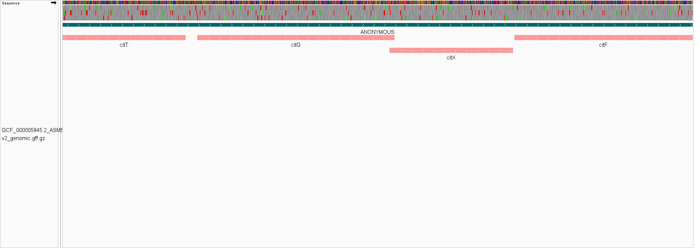
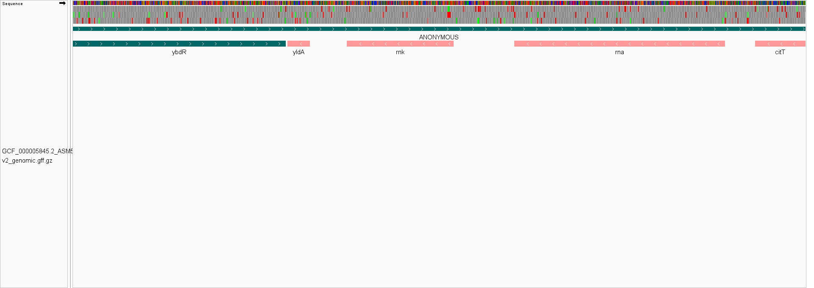

# Week_02: Visualize Genomic Data

## Genome Selected

For this assignment, I selected *Escherichia coli* K-12 MG1655.

- **RefSeq Assembly Accession:** `GCF_000005845.2`
- **Assembly Name:** `ASM584v2`
- **Reference Chromosome:** `NC_000913.3`
- **Data Source:** NCBI RefSeq

The FASTA and GFF files were obtained from the same genome assembly so that the genome sequence and annotation coordinates correspond to each other.

---

## Downloading the Genomic Data

The genomic FASTA and GFF annotation files were downloaded using a `Makefile`.

To download the files, run:

```bash
make
```

The downloaded files are stored in the `data/` directory:

```text
data/GCF_000005845.2_ASM584v2_genomic.fna.gz
data/GCF_000005845.2_ASM584v2_genomic.gff.gz
```

---

## Genome Size

I calculated the genome size using:

```bash
zcat data/GCF_000005845.2_ASM584v2_genomic.fna.gz | grep -v "^>" | tr -d '\n' | wc -c
```

Output:

```text
4641652
```

Therefore, the genome size of *E. coli* K-12 MG1655 is **4,641,652 bp**, or approximately **4.64 Mb**.

---

## Number of Chromosomes

I counted the number of FASTA sequence headers using:

```bash
zgrep -c "^>" data/GCF_000005845.2_ASM584v2_genomic.fna.gz
```

Output:

```text
1
```

Therefore, this genome assembly contains **one chromosome**.

---

## Number of Annotations

I counted all non-comment feature records in the GFF annotation file using:

```bash
zgrep -v "^#" data/GCF_000005845.2_ASM584v2_genomic.gff.gz | wc -l
```

Output:

```text
9523
```

Therefore, the GFF file contains **9,523 annotation records**.

This number represents all feature records in the annotation file and is not limited to genes.

---

## Completeness of the Genome Build

In my opinion, this genome build is highly complete. The assembly consists of a single chromosome rather than many fragmented contigs or scaffolds. *E. coli* K-12 MG1655 is also a well-established reference strain, making this assembly suitable for genome analysis and visualization.

---

# Genome Visualization in IGV

## Preparing the Genome for IGV

The compressed FASTA file was decompressed while keeping the original file using:

```bash
gunzip -k data/GCF_000005845.2_ASM584v2_genomic.fna.gz
```

I then indexed the FASTA file using:

```bash
samtools faidx data/GCF_000005845.2_ASM584v2_genomic.fna
```

The following files were loaded into IGV:

- **Reference genome:** `GCF_000005845.2_ASM584v2_genomic.fna`
- **Annotation track:** `GCF_000005845.2_ASM584v2_genomic.gff.gz`

---

## Gene Density

The genes in the region I inspected appeared to be **[tightly/loosely] packed**.

The approximate gene-to-gene distance was around **[enter estimated distance] bp**.

Most genes appeared to have relatively short intergenic regions, which is consistent with the compact organization of a bacterial genome.

### IGV View of Gene Density



---

## Chromosome Coordinate Inspected

I selected the following coordinate for closer inspection:

```text
NC_000913.3:[ENTER COORDINATE]
```

At this position, I observed:

> [Describe what you see around the selected coordinate.]

For example, mention whether the coordinate is inside a gene, between genes, or close to another annotated feature.

---

## Six Possible Reading Frames

Because DNA has two strands and each strand can be translated in three possible reading frames, there are six possible reading frames in total.

For the coordinate selected above, the possible codons are:

| Strand | Reading Frame | Codon |
|---|---|---|
| Forward (+) | +1 | `[CODON]` |
| Forward (+) | +2 | `[CODON]` |
| Forward (+) | +3 | `[CODON]` |
| Reverse (-) | -1 | `[CODON]` |
| Reverse (-) | -2 | `[CODON]` |
| Reverse (-) | -3 | `[CODON]` |

### IGV View of the Sequence


---

## Feature Type Displayed in the Annotation Track

The GFF annotation file was displayed in IGV as a feature track.

The feature I inspected was a:

**[gene / CDS / tRNA / rRNA / ncRNA / other]**

Additional information observed in IGV:

> [Enter the feature name, location, or other information shown by IGV.]

---

## Strand Orientation

The annotation features were colored according to their strand orientation.

- **Forward strand (+):** [enter color]
- **Reverse strand (-):** [enter color]

Coloring the features by strand makes it easier to distinguish genes located on opposite DNA strands.

### IGV View Showing Strand Orientation



---

## Summary

The *E. coli* K-12 MG1655 genome is approximately **4.64 Mb** in size and consists of **one chromosome**. The GFF annotation file contains **9,523 annotation records**. Visualization in IGV makes it possible to inspect genome organization, gene density, annotated features, nucleotide sequences, reading frames, and strand orientation.