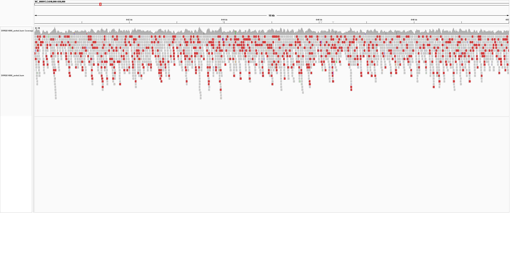
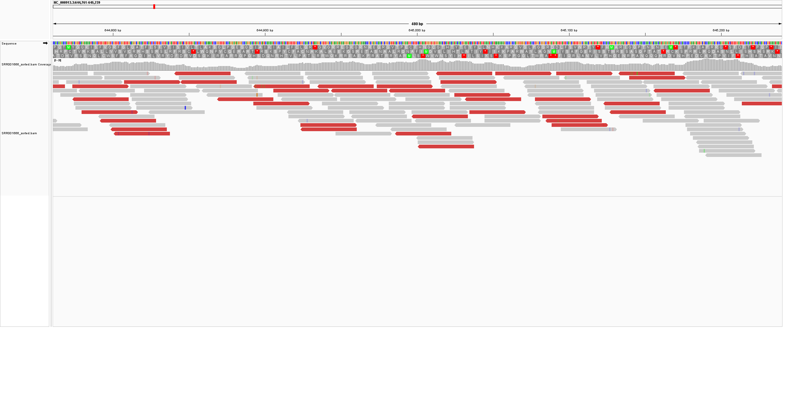

# Week_05: Generate a BAM File

## Genome and Sequencing Data

For this assignment, I continued working with the genome and sequencing dataset used in my previous assignments.

- **Organism:** *Escherichia coli* K-12 MG1655
- **Reference assembly:** `GCF_000005845.2`
- **Assembly name:** `ASM584v2`
- **Reference chromosome:** `NC_000913.3`
- **Genome size:** 4,641,652 bp
- **SRA accession:** `SRR001666`
- **Sequencing layout:** Paired-end
- **Read length:** 36 bp

The goal was to align a subset of the sequencing reads to the MG1655 reference genome, create a sorted BAM file, calculate alignment statistics, and visualize the alignment in IGV.

---

# Required Software

The analysis was performed in the `bioinfo` environment.

```bash
conda activate bioinfo
```

The main tools used were:

```bash
bowtie2 --version | head -n 1
samtools --version | head -n 1
fastq-dump --version
fastp --version
```

Versions used:

```text
Bowtie2 2.5.2
samtools 1.24
fastq-dump 3.4.1
fastp 1.3.6
```

---

# Determining the Number of Reads

The assignment required enough sequencing data to obtain at least **10× genome coverage**.

The genome size is:

```text
4,641,652 bp
```

The sequencing run contains paired-end reads of approximately:

```text
36 bp per read
```

Each paired-end SRA spot therefore contributes approximately:

```text
36 × 2 = 72 bp
```

The theoretical number of spots needed for 10× coverage is:

```text
N = (10 × genome size) / (2 × read length)
```

Therefore:

```text
N = (10 × 4,641,652) / (2 × 36)
  ≈ 644,674 spots
```

However, not all downloaded reads survive quality filtering or align to the reference genome.

I first tested the pipeline using:

```text
N = 10,000
```

The test produced a mean depth of approximately:

```text
0.146×
```

I then tested:

```text
N = 700,000
```

which produced:

```text
9.66× mean depth
```

Since this was slightly below the required 10× coverage, I increased the final subset to:

```text
N = 750,000 SRA spots
```

The final dataset produced a mean depth of:

```text
10.36×
```

Therefore, **750,000 spots** were used for the final analysis.

---

# Workflow

The Makefile automates the complete analysis:

```text
Reference genome
      ↓
Download FASTA
      ↓
Build Bowtie2 index
      ↓
Download first N SRA spots
      ↓
FASTQ files
      ↓
fastp quality filtering
      ↓
Bowtie2 alignment
      ↓
samtools sort
      ↓
Sorted BAM
      ↓
samtools index
      ↓
BAM statistics
```

The analysis can be reproduced by running:

```bash
make
```

The default settings are:

```text
SRR = SRR001666
N = 750000
```

A different number of SRA spots can also be specified:

```bash
make N=10000
```

or:

```bash
make N=750000
```

Generated files are organized into separate directories:

```text
Week_05/
├── Makefile
├── README.md
├── reference/
├── raw_data/
├── trimmed_data/
├── alignment/
├── stats/
└── images/
```

---

# Reference Genome

The Makefile downloads the *E. coli* K-12 MG1655 reference genome from NCBI:

```text
GCF_000005845.2_ASM584v2_genomic.fna
```

It then creates:

```text
reference/GCF_000005845.2_ASM584v2_genomic.fna.fai
```

using `samtools faidx`.

A Bowtie2 index is also generated from the reference genome before alignment.

---

# FASTQ Download and Quality Filtering

The first 750,000 SRA spots from:

```text
SRR001666
```

were downloaded using `fastq-dump`.

Because the sequencing run is paired-end, this initially produced:

```text
750,000 R1 reads
750,000 R2 reads
```

The reads were then quality-filtered using `fastp`.

After filtering:

```text
R1 reads retained: 671,321
R2 reads retained: 671,321
```

Therefore:

```text
671,321 / 750,000 ≈ 89.5%
```

of the read pairs were retained.

A total of:

```text
78,679 read pairs
```

were removed during quality filtering.

The majority of failed reads were removed because of low sequence quality.

---

# Alignment and BAM Creation

The quality-filtered reads were aligned to the MG1655 reference genome using Bowtie2 with the `--very-sensitive` option.

The alignment output was sent directly to `samtools sort`, avoiding the need to create a large intermediate SAM file.

The final BAM file is:

```text
alignment/SRR001666_sorted.bam
```

The BAM index is:

```text
alignment/SRR001666_sorted.bam.bai
```

The BAM file was indexed using:

```bash
samtools index alignment/SRR001666_sorted.bam
```

---

# Alignment Statistics

The Makefile generates alignment statistics using:

```bash
samtools flagstat alignment/SRR001666_sorted.bam
```

```bash
samtools stats alignment/SRR001666_sorted.bam
```

and:

```bash
samtools coverage alignment/SRR001666_sorted.bam
```

---

## What Percent of the Reads Aligned?

Bowtie2 reported:

```text
99.64% overall alignment rate
```

The final BAM contained:

```text
1,342,642 total quality-filtered reads
1,337,810 mapped reads
```

The `samtools flagstat` report also showed:

```text
978,178 properly paired reads
```

corresponding to:

```text
72.85% properly paired
```

Therefore, almost all of the quality-filtered reads aligned somewhere to the MG1655 reference genome.

---

# Genome Coverage

The `samtools coverage` report produced:

```text
Reference:            NC_000913.3
Genome length:        4,641,652 bp
Mapped reads:         1,337,810
Covered bases:        4,640,923 bp
Genome covered:       99.9843%
Mean depth:           10.3618×
Mean base quality:    32.3
Mean mapping quality: 41
```

The final mean sequencing depth was therefore:

**10.36×**

which satisfies the assignment requirement of at least **10× coverage**.

Almost the entire reference chromosome was covered:

**99.9843%**

---

# BAM Visualization in IGV

The sorted BAM file was visualized in IGV together with the MG1655 reference genome.

The files loaded were:

```text
reference/GCF_000005845.2_ASM584v2_genomic.fna
alignment/SRR001666_sorted.bam
alignment/SRR001666_sorted.bam.bai
```

---

## Coverage Across a 10 kb Region

I inspected the region:

```text
NC_000913.3:640,000-650,000
```

The coverage track was continuous across the region, although read depth varied from position to position.

There were no obvious long regions without sequencing coverage.

The coverage was therefore broadly distributed but not perfectly uniform, which is expected for sequencing data.



---

## Alignment Appearance and Possible Differences

I also zoomed into a smaller region to inspect individual aligned reads.

Most reads aligned closely to the reference sequence.

Occasional colored bases were visible within individual reads, indicating mismatches between the sequencing reads and the reference genome.

Isolated mismatches may represent sequencing errors. A mismatch that is repeatedly supported by many independent reads could potentially represent a real sequence difference.

However, no formal variant-calling analysis was performed in this assignment, so these mismatches were not interpreted as confirmed variants.



---

# Is the Coverage Uniform?

The coverage was not perfectly uniform.

The IGV coverage track showed fluctuations in read depth across the inspected region, with some areas having somewhat higher or lower coverage than neighboring regions.

However, the coverage remained broadly continuous, and the BAM statistics showed that:

```text
99.9843% of the chromosome was covered
```

with an average depth of:

```text
10.36×
```

Therefore, the reads provided nearly complete genome coverage despite normal local variation in sequencing depth.

---

# Summary

For this assignment, I aligned paired-end sequencing reads from `SRR001666` to the *E. coli* K-12 MG1655 reference genome.

A theoretical calculation suggested that approximately 644,674 paired-end SRA spots would provide 10× raw coverage. Because quality filtering and alignment reduce the usable amount of sequence data, I tested larger subsets and ultimately used **750,000 spots**.

After quality filtering, **671,321 read pairs** remained. Bowtie2 produced an overall alignment rate of **99.64%**.

The final BAM file had:

```text
Mean depth:       10.36×
Genome covered:   99.9843%
Mapped reads:     1,337,810
```

IGV visualization showed broadly continuous genome coverage with normal local variation in depth. Most reads matched the reference closely, although occasional mismatching bases were visible.

The complete workflow is automated through the Makefile and can be reproduced using:

```bash
make
```