# Week_06: Evaluate Structural Variants

## Overview

In this assignment, I visually inspected five paired-end read alignments in IGV and made my best estimate of the genomic variation present in each sample relative to the reference genome.

The reference genome used for the analysis was:

```text
https://data.biostarhandbook.com/courses/2026-appbio/igv/fasta/ebola-1976.fa
```

The five BAM files were examined in IGV using several visualization settings, including:

- View as pairs
- Color by read strand
- Color by insert size
- Group by pair orientation
- Coverage track

I used changes in read coverage, abnormal insert sizes, unusual pair orientations, and consistent insertion/deletion markers to distinguish between possible structural variants.

---

# Summary

| Sample | Best interpretation |
|---|---|
| Sample 1 | Insertion / small insertion-type variation |
| Sample 2 | No major structural variant |
| Sample 3 | Duplication |
| Sample 4 | Inversion |
| Sample 5 | Deletion |

---

# Sample 1

## Best interpretation: Insertion

Sample 1 appears to contain insertion-type variation relative to the reference genome. Most of the genome shows relatively continuous coverage, and there is no strong localized pattern of abnormal insert sizes or pair orientations that would suggest a large deletion, duplication, or inversion.

However, when the alignment was examined at higher resolution, several reads showed insertion markers at the same genomic positions. For example, near approximately 1,520 bp, multiple independent reads contained a `3I` marker, indicating an approximately 3-base insertion relative to the reference sequence. Similar insertion-type signals were also visible at another position near approximately 14,950 bp.

Because these insertion markers were supported by multiple reads while the surrounding alignment remained relatively normal, my best interpretation is that Sample 1 contains small insertion-type variation relative to the reference genome.

### IGV views

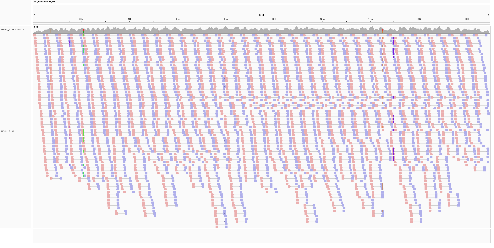

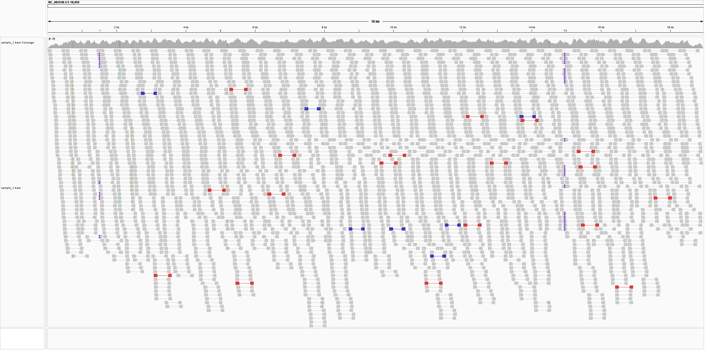

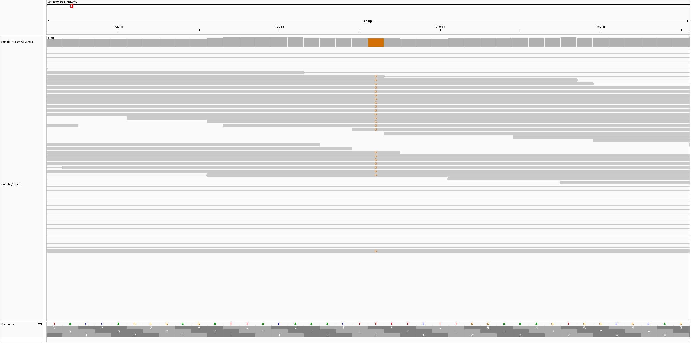

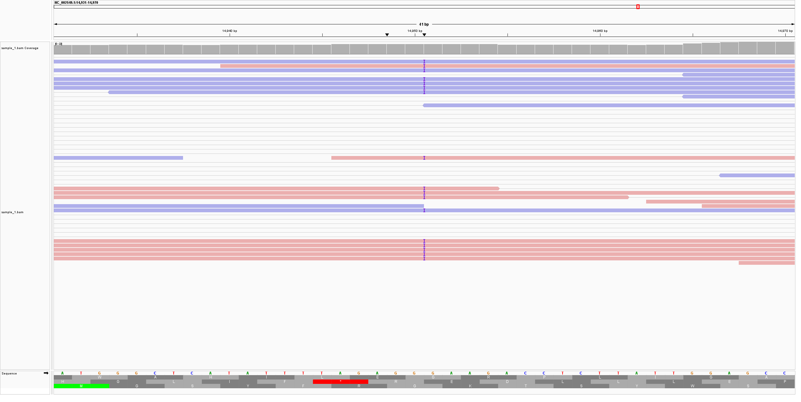

---

# Sample 2

## Best interpretation: No major structural variant

Sample 2 does not show clear evidence of a major structural variant relative to the reference genome. The coverage remains relatively continuous across the genome, and there is no strong localized cluster of abnormal insert sizes or unusual pair orientations.

A number of nucleotide mismatches are visible throughout the reads, and some small insertion or deletion markers are also present. However, these differences are distributed throughout the genome and do not form a consistent breakpoint pattern associated with a large structural rearrangement.

The few discordant read pairs that are present are scattered rather than concentrated within one genomic interval. Therefore, my best interpretation is that Sample 2 contains sequence-level differences relative to the reference but **no obvious major structural variant**.

### IGV views

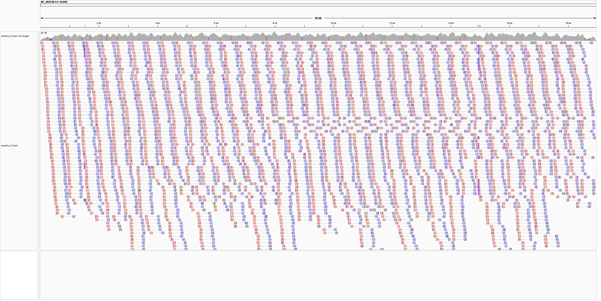

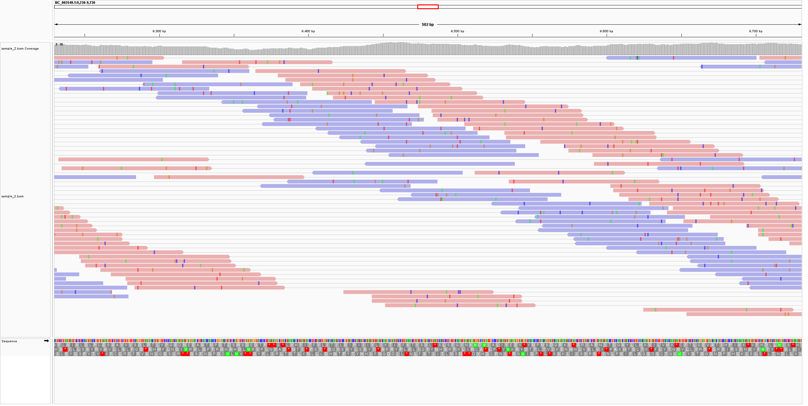

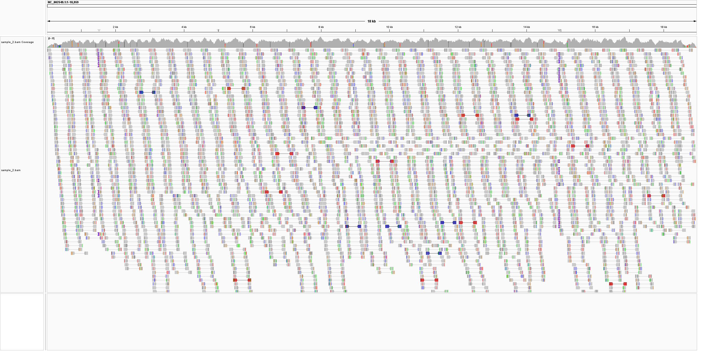

---

# Sample 3

## Best interpretation: Duplication

Sample 3 shows evidence of a duplication relative to the reference genome.

The strongest signal is a clear increase in read coverage between approximately 3,000 and 4,000 bp. Coverage rises sharply when entering this region, remains elevated across the interval, and then returns to approximately the surrounding baseline.

A localized increase in sequencing depth is consistent with a duplication because multiple copies of the same sequence in the sample can align to a single corresponding region in the reference genome.

Some unusual paired-end alignments are also visible around this region, which provides additional evidence of a structural rearrangement.

Therefore, my best interpretation is that Sample 3 contains a **duplication of approximately a 1 kb genomic region around 3–4 kb**.

### IGV views

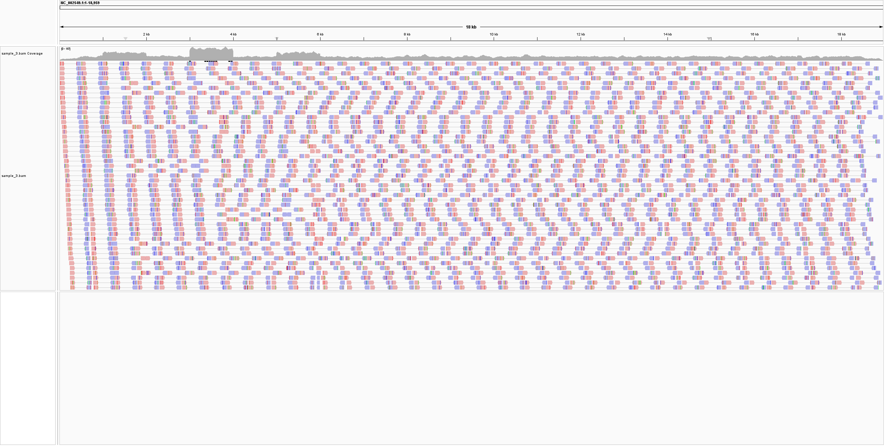

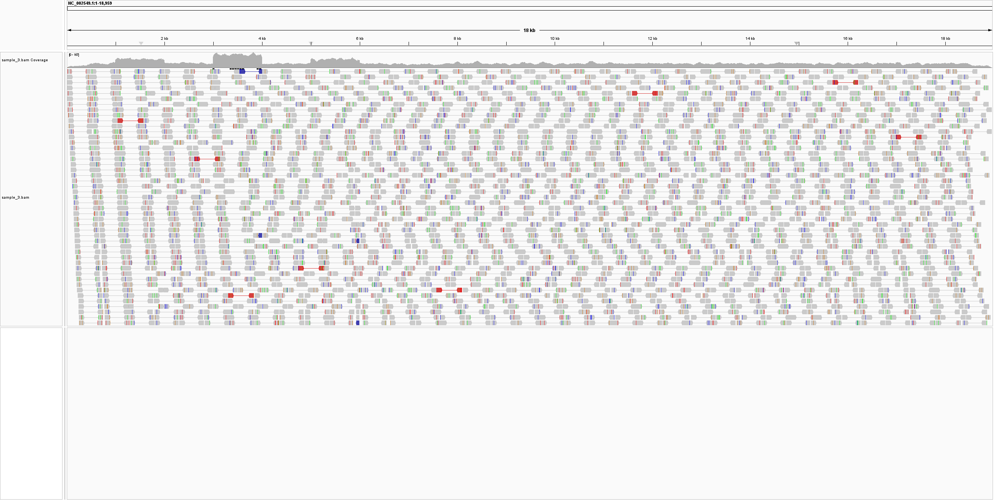

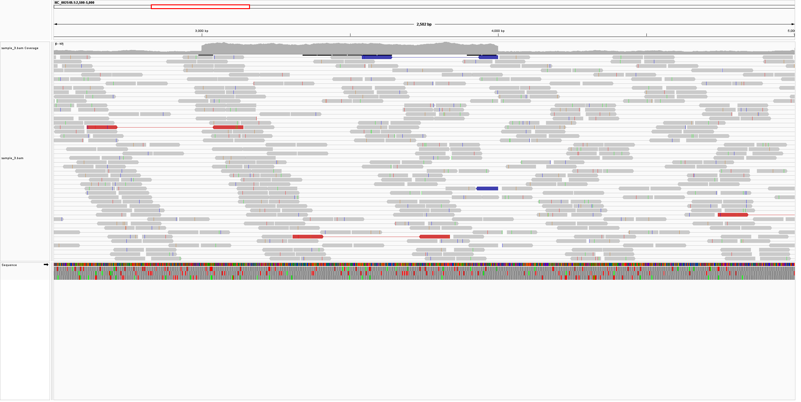

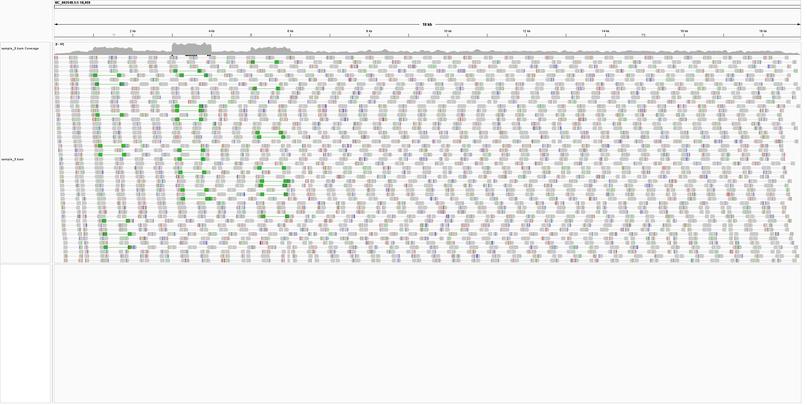

---

# Sample 4

## Best interpretation: Inversion

Sample 4 shows strong evidence of an inversion relative to the reference genome.

The coverage across the region remains relatively stable, suggesting that the amount of DNA has not substantially increased or decreased. However, the paired-end reads around approximately 5–6 kb show a strong abnormal orientation pattern.

When the reads were grouped by pair orientation, a large cluster of `RR`-oriented read pairs was visible in this region. Normally oriented paired-end reads should not form such a large localized group of same-orientation pairs.

This type of discordant orientation is consistent with an inversion, where a genomic segment has been reversed relative to the reference sequence.

Therefore, my best interpretation is that Sample 4 contains an **inversion affecting approximately the 5–6 kb region**.

### IGV views

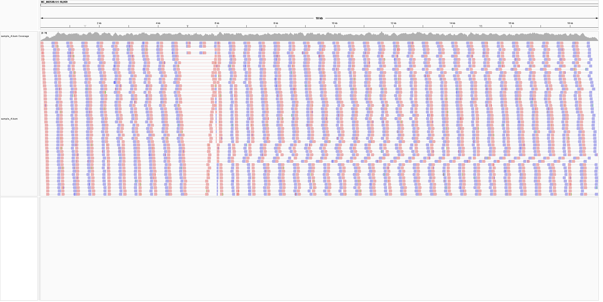

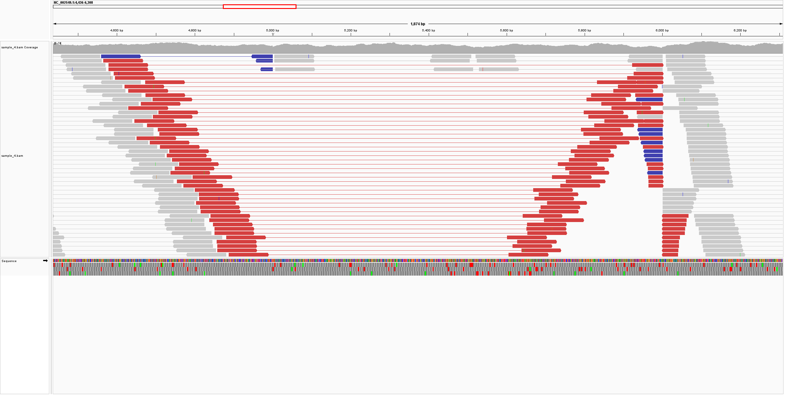

---

# Sample 5

## Best interpretation: Deletion

Sample 5 shows strong evidence of a deletion relative to the reference genome.

A large cluster of paired-end reads around approximately 5–6.5 kb shows abnormally large apparent insert sizes. Many pairs span a much larger distance on the reference genome than would normally be expected.

This is consistent with a deletion in the sample. If a section of DNA is missing from the sample, reads located on opposite sides of that deleted region are physically closer together in the sample genome. When those reads are aligned against the complete reference genome, the two mates appear unusually far apart.

The abnormal read pairs are concentrated within the same genomic region rather than being scattered randomly throughout the genome.

Therefore, my best interpretation is that Sample 5 contains a **deletion of approximately 1–1.5 kb in the 5–6.5 kb region**.

### IGV view

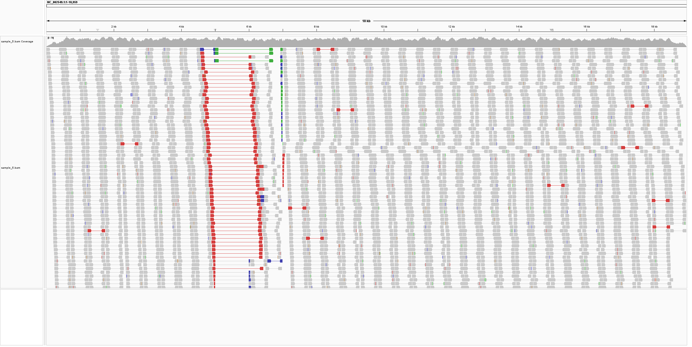

---

# Final Interpretation

Based on visual inspection of the five mock alignment datasets in IGV, I identified different alignment patterns associated with genomic variation.

Sample 1 showed small insertion-type variation supported by repeated insertion markers. Sample 2 did not show a clear large structural rearrangement. Sample 3 showed a localized increase in coverage consistent with a duplication. Sample 4 contained a strong cluster of abnormal read-pair orientations consistent with an inversion. Sample 5 contained a large cluster of abnormally long read pairs consistent with a deletion.

These interpretations represent my best visual estimates based on the alignment patterns observed in IGV.