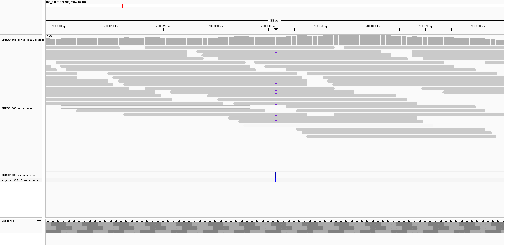
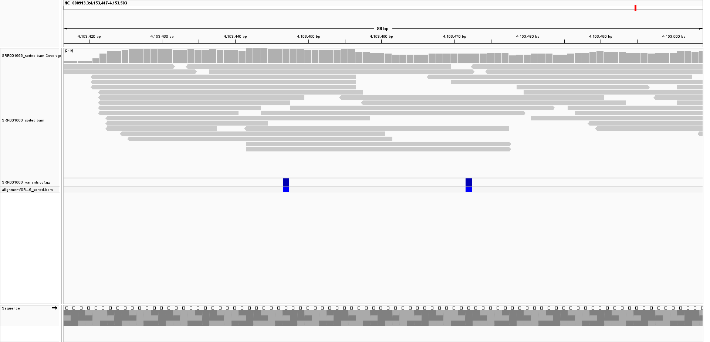
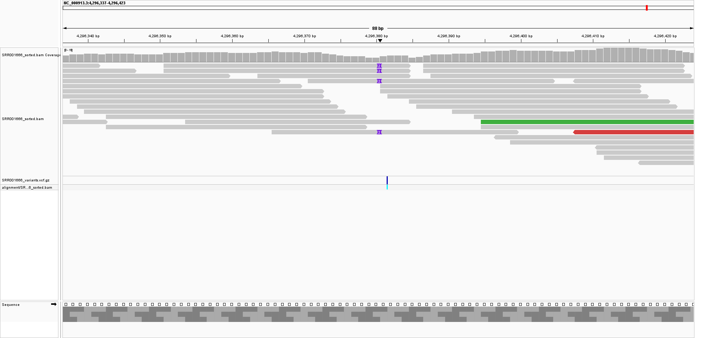
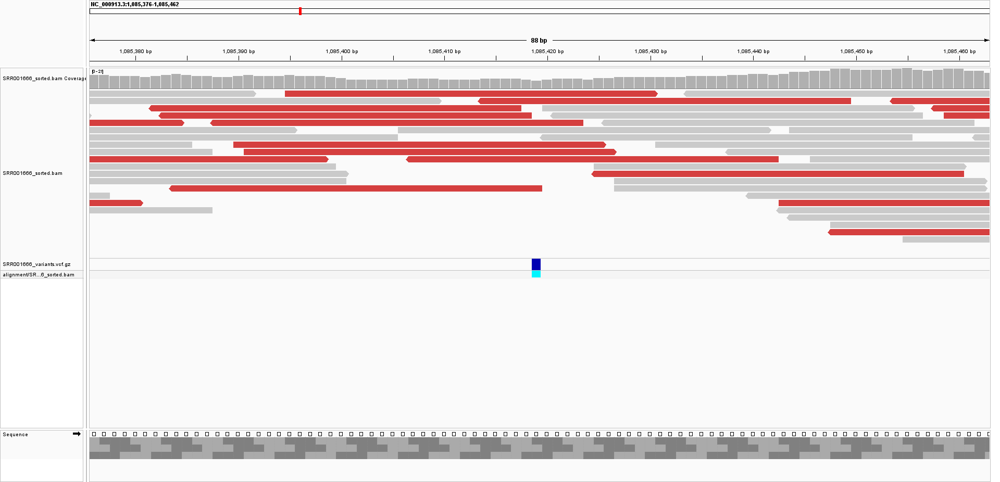
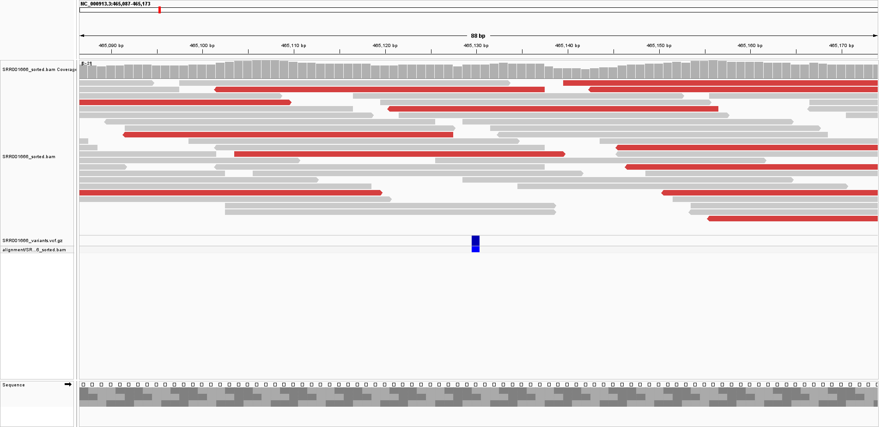
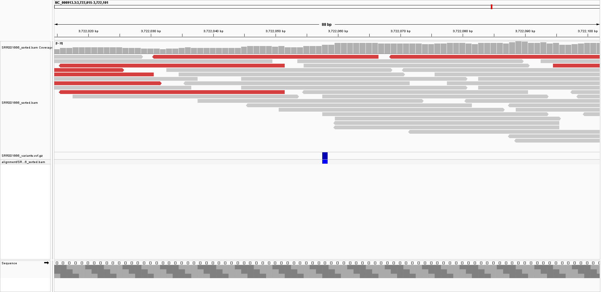

# Week_07: Generate a VCF File

## Overview

In this assignment, I extended my previous BAM-generation workflow to call sequence variants and generate a VCF file.

I continued using the same *Escherichia coli* K-12 MG1655 dataset used in Week 05.

- **Organism:** *Escherichia coli* K-12 MG1655
- **Reference assembly:** `GCF_000005845.2`
- **Reference chromosome:** `NC_000913.3`
- **SRA run:** `SRR001666`
- **Number of SRA spots used:** 750,000
- **Mean BAM coverage:** 10.36×
- **Genome covered:** 99.9843%

The Makefile automates the workflow from downloading the sequencing reads through alignment, BAM generation, variant calling, and VCF statistics.

---

## Workflow

```text
Reference genome
      ↓
Download sequencing reads
      ↓
fastp quality filtering
      ↓
Bowtie2 alignment
      ↓
samtools sort
      ↓
Sorted and indexed BAM
      ↓
bcftools mpileup
      ↓
bcftools call
      ↓
VCF file
      ↓
VCF index
      ↓
bcftools statistics
```

---

## Software

The main tools used were:

- `fastq-dump`
- `fastp`
- `bowtie2`
- `samtools`
- `bcftools`

The version of bcftools used was:

```text
bcftools 1.24
```

---

## Reproducing the Analysis

From inside the `Week_07` directory, run:

```bash
make
```

The default parameters are:

```text
SRR = SRR001666
N = 750000
```

The complete analysis can also be run explicitly with:

```bash
make N=750000
```

---

## BAM Coverage

The final BAM file was analyzed with:

```bash
samtools coverage alignment/SRR001666_sorted.bam
```

The final alignment produced:

```text
Genome length:        4,641,652 bp
Mapped reads:         1,337,810
Genome covered:       99.9843%
Mean depth:           10.3618×
Mean base quality:    32.3
Mean mapping quality: 41
```

Therefore, the BAM exceeded the required average coverage of 10×.

---

# Variant Calling

Variants were called from the sorted BAM file using `bcftools mpileup` and `bcftools call`.

The main variant-calling step was:

```bash
bcftools mpileup \
    -Ou \
    -f reference/GCF_000005845.2_ASM584v2_genomic.fna \
    -a FORMAT/AD,FORMAT/DP \
    alignment/SRR001666_sorted.bam \
| bcftools call \
    -mv \
    -Oz \
    -o variants/SRR001666_variants.vcf.gz
```

The VCF file was indexed using:

```bash
bcftools index -t variants/SRR001666_variants.vcf.gz
```

---

## How Many Variants Were Called?

The final VCF contained:

```text
Total variants: 232
SNPs:           230
Indels:           2
```

The `bcftools stats` report independently confirmed these values.

---

## What Kinds of Variants Were Present?

Most of the calls were single-nucleotide polymorphisms (SNPs), including substitutions such as:

```text
C → T
A → G
G → A
```

Two indels were also detected.

One example occurred at:

```text
NC_000913.3:4296380
REF = AC
ALT = ACGC
```

This represents an insertion relative to the reference genome.

---

# High-Confidence Variant Calls

To evaluate whether the VCF calls were supported by the alignments, I loaded both the BAM and VCF files into IGV.

```text
alignment/SRR001666_sorted.bam
variants/SRR001666_variants.vcf.gz
```

## High-confidence SNP: position 780841

The variant:

```text
NC_000913.3:780841
C → T
```

had:

```text
QUAL = 78.19
DP   = 17
AD   = 9,8
```

This was the highest-quality call that I inspected. Nine reads supported the reference allele and eight supported the alternate allele. Multiple independent reads showed the same difference at the called position, providing strong alignment support.

This call therefore appears likely to represent a true variant.



---

## High-confidence SNP: position 4153447

The variant:

```text
NC_000913.3:4153447
A → G
```

had:

```text
QUAL = 52.10
DP   = 15
AD   = 10,5
```

Five reads supported the alternate allele and ten supported the reference allele. The relatively high quality score and multiple supporting reads make this a well-supported variant call.



---

## High-confidence indel: position 4296380

The indel:

```text
NC_000913.3:4296380
AC → ACGC
```

had:

```text
QUAL = 40.20
DP   = 6
AD   = 2,3
```

In IGV, several reads showed the same insertion marker at this position. The repeated insertion signal across independent reads provides visual support for the indel call.



---

# Low-Confidence Calls and Possible Errors

Some variants had very low quality scores or very little independent read support. These calls are less convincing and could represent sequencing or alignment errors.

## Low-confidence call: position 1085419

The call:

```text
NC_000913.3:1085419
G → A
```

had:

```text
QUAL = 3.22
DP   = 1
AD   = 0,1
```

Only one read covered and supported the alternate allele. Because there is no independent supporting read, this call is highly uncertain and may represent an error.



---

## Low-confidence call: position 465130

The call:

```text
NC_000913.3:465130
T → A
```

had:

```text
QUAL = 3.38
DP   = 13
AD   = 11,2
```

Although this position had reasonable coverage, only two of thirteen reads supported the alternate allele. Most reads supported the reference allele.

The low quality score and low fraction of alternate-supporting reads make this call much less convincing than the high-confidence examples.



---

## Low-confidence call: position 3722058

The call:

```text
NC_000913.3:3722058
C → T
```

had:

```text
QUAL = 3.40
DP   = 13
AD   = 11,2
```

Again, only two reads supported the alternate allele while eleven supported the reference allele. This weak support and low quality score suggest that the call may represent sequencing noise or an alignment artifact.



---

# Which Calls Look Like True Variants?

The strongest variant calls generally had:

- relatively high VCF quality scores,
- several independent reads supporting the alternate allele,
- sufficient read depth,
- and visible support in the BAM alignment.

For example, the SNP at position 780841 had a quality score of approximately 78 and eight alternate-supporting reads out of seventeen total reads.

The indel at position 4296380 was also supported by multiple reads showing the same insertion pattern.

These calls appear more likely to represent genuine sequence differences relative to the reference genome.

---

# Which Calls Look Like Errors?

Several low-quality calls had very little support for the alternate allele.

The call at position 1085419 was supported by only one read. At positions 465130 and 3722058, only two of thirteen reads supported the alternate allele.

These calls could represent:

- sequencing errors,
- alignment errors,
- low-frequency mismatches,
- or otherwise uncertain variant calls.

Therefore, the presence of a call in the VCF alone is not sufficient to establish that it represents a true sequence variant.

---

# Are the Calls Supported by the Alignments?

IGV showed that alignment support varied greatly among the calls.

High-confidence variants were supported by several independent reads showing the same alternate allele at the same genomic position.

In contrast, low-confidence calls were often supported by only one or two reads while most reads supported the reference sequence.

The visual inspection therefore supports some VCF calls strongly, while other calls should be interpreted cautiously.

---

# Final Summary

The Week 07 workflow successfully extended the previous BAM workflow to perform variant calling.

The final alignment had:

```text
Mean depth:      10.36×
Genome covered:  99.9843%
```

Variant calling identified:

```text
232 total variants
230 SNPs
2 indels
```

The IGV analysis showed that the reliability of individual calls varied considerably. High-quality calls such as the SNP at position 780841 and the indel at position 4296380 had support from multiple independent reads. Other calls had low quality scores and only one or two alternate-supporting reads, making them more likely to represent sequencing or alignment errors.

This demonstrates the importance of evaluating both VCF statistics and the underlying read alignments when interpreting variant calls.